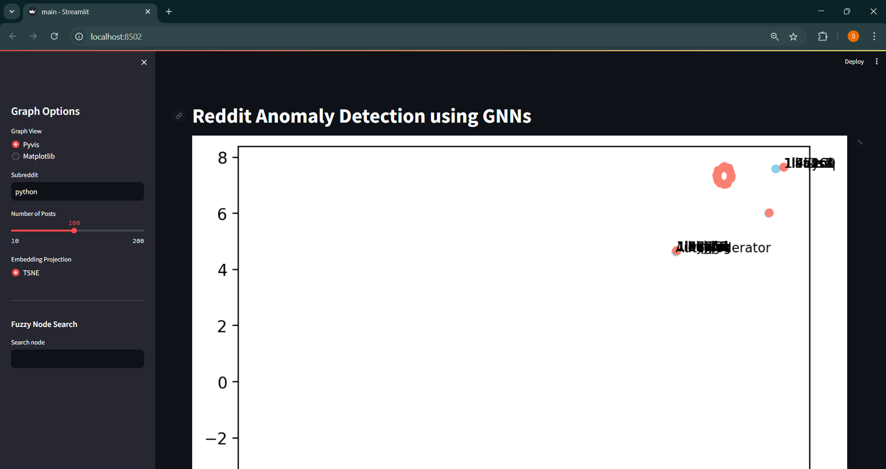
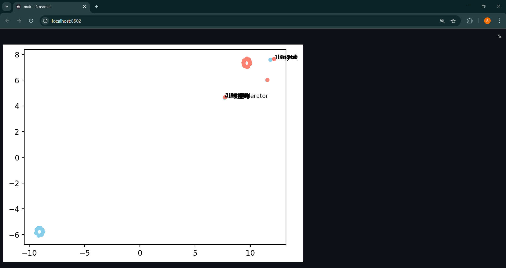
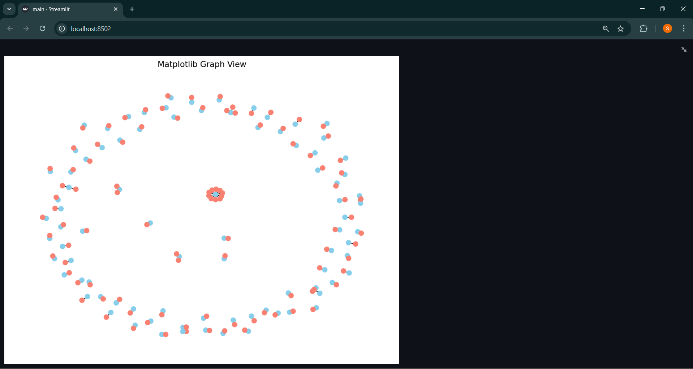
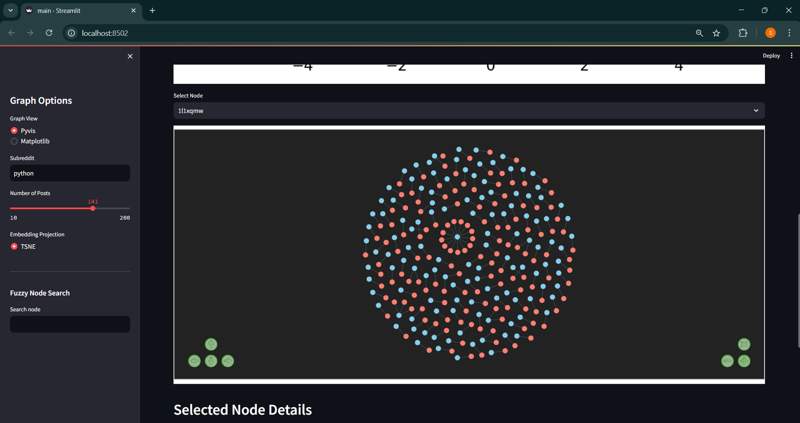
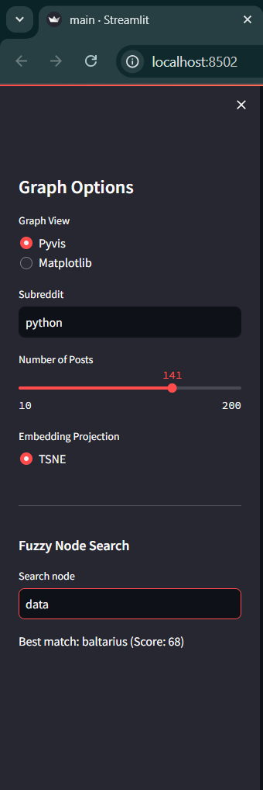
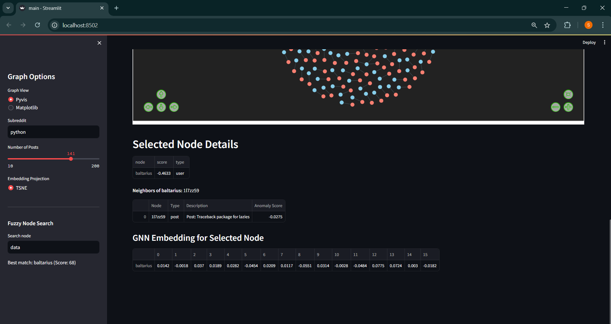

# Reddit Anomaly Detection with Graph Neural Networks

A Streamlit web application that uses Graph Neural Networks (GNNs) to detect anomalous patterns in Reddit posts and user interactions. The app creates a bipartite graph of users and posts, applies a Graph Convolutional Network (GCN) to learn node embeddings, and identifies anomalies based on embedding norms.

## 🚀 Features

- **Reddit Data Fetching**: Automatically fetches posts from any subreddit using the Reddit API
- **Graph Construction**: Creates bipartite graphs connecting users to their posts
- **Graph Neural Networks**: Uses PyTorch Geometric GCN to learn node embeddings
- **Anomaly Detection**: Identifies unusual patterns in user-post relationships
- **Interactive Visualizations**: 
  - Interactive network graphs with Pyvis
  - Static matplotlib plots
  - 2D projections using t-SNE (UMAP optional)
- **Fuzzy Search**: Find similar posts using fuzzy string matching
- **Real-time Analysis**: Streamlit interface for interactive exploration

## � Screenshots

### Main Interface

*The main Streamlit interface showing the sidebar controls and main content area*

### Interactive Network Graph

*Interactive Pyvis network visualization showing user-post relationships*

### Anomaly Detection Results

*Anomaly detection results with ranked nodes and their scores*

### 2D Embedding Projection

*t-SNE projection of node embeddings colored by anomaly scores*

### Fuzzy Search Feature

*Fuzzy search functionality for finding similar posts*

### Graph Statistics

*Network statistics and metrics display*

## �🛠️ Technology Stack

- **Frontend**: Streamlit
- **Graph Processing**: NetworkX, PyTorch Geometric
- **Machine Learning**: PyTorch, scikit-learn
- **Data Processing**: Pandas, NumPy
- **Visualization**: Pyvis, Matplotlib
- **Reddit API**: PRAW (Python Reddit API Wrapper)
- **Text Processing**: FuzzyWuzzy

## 📋 Prerequisites

- Python 3.7+
- Reddit API credentials (client_id, client_secret)
- Anaconda/Miniconda (recommended)

## 🔧 Installation

1. **Clone the repository**:
   ```bash
   git clone <repository-url>
   cd Anomaly_Detection
   ```

2. **Create a virtual environment** (recommended):
   ```bash
   conda create -n reddit-anomaly python=3.9
   conda activate reddit-anomaly
   ```

3. **Install dependencies**:
   ```bash
   pip install -r requirements.txt
   ```

4. **Set up Reddit API credentials**:
   - Go to [Reddit App Preferences](https://www.reddit.com/prefs/apps)
   - Create a new application (script type)
   - Update the credentials in `main.py`:
     ```python
     reddit = praw.Reddit(
         client_id="your_client_id",
         client_secret="your_client_secret",
         user_agent="your_app_name"
     )
     ```

## 🚀 Usage

1. **Start the application**:
   ```bash
   streamlit run main.py
   ```

2. **Open your browser** and navigate to `http://localhost:8501`

3. **Configure the analysis**:
   - Enter a subreddit name (e.g., "python", "MachineLearning")
   - Set the number of posts to fetch
   - Choose visualization options
   - Select projection method (t-SNE or UMAP if available)

4. **Analyze results**:
   - View the interactive graph
   - Examine anomaly scores
   - Explore 2D projections
   - Search for similar posts

## 📊 How It Works

### 1. Data Collection
- Fetches hot posts from specified subreddit using Reddit API
- Extracts post metadata: title, score, author, comments, etc.

### 2. Graph Construction
- Creates a bipartite graph with users and posts as nodes
- Edges connect users to their posts
- Node features include degree centrality and other metrics

### 3. Graph Neural Network
- Applies a 2-layer Graph Convolutional Network (GCN)
- Learns embeddings that capture user-post relationship patterns
- Uses node degree as initial features

### 4. Anomaly Detection
- Calculates L2 norms of node embeddings
- Standardizes scores (z-score normalization)
- Higher scores indicate more anomalous patterns

### 5. Visualization
- **Interactive Graph**: Pyvis network with hover information
- **2D Projection**: t-SNE/UMAP for embedding visualization
- **Anomaly Ranking**: Sorted list of most anomalous nodes

## 📁 Project Structure

```
Anomaly_Detection/
├── main.py                 # Main Streamlit application
├── requirements.txt        # Python dependencies
├── README.md              # This file
├── graph.html             # Generated interactive graph
├── screenshots/           # Application screenshots
│   ├── main_interface.png
│   ├── interactive_graph.png
│   ├── anomaly_results.png
│   ├── embedding_projection.png
│   ├── fuzzy_search.png
│   └── graph_statistics.png
├── lib/                   # JavaScript libraries
│   ├── vis-9.1.2/        # Vis.js network library
│   ├── tom-select/       # Tom Select library
│   └── bindings/         # Python-JS bindings
└── .vscode/              # VS Code settings
```

## 🔍 Key Components

### Graph Neural Network Architecture
```python
class GCN(torch.nn.Module):
    def __init__(self, in_channels, hidden_channels):
        super().__init__()
        self.conv1 = GCNConv(in_channels, hidden_channels)
        self.conv2 = GCNConv(hidden_channels, hidden_channels)

    def forward(self, data):
        x, edge_index = data.x, data.edge_index
        x = self.conv1(x, edge_index)
        x = F.relu(x)
        x = self.conv2(x, edge_index)
        return x
```

### Anomaly Scoring
- Embeddings are learned through the GCN
- L2 norms of embeddings indicate node "unusualness"
- Z-score normalization for interpretable scores

## ⚠️ Known Issues & Solutions

### UMAP Import Issues
If UMAP fails to import due to numba/llvmlite conflicts:
- The app automatically falls back to t-SNE
- UMAP option is hidden from the interface
- No functionality is lost

### Dependency Conflicts
If you encounter package conflicts:
```bash
# Ensure compatible numpy version
pip install "numpy>=1.22.4,<2.0"

# Install missing backports
pip install backports.tarfile

# Improve FuzzyWuzzy performance
pip install python-Levenshtein
```

## 🎯 Use Cases

- **Content Moderation**: Identify unusual posting patterns
- **Bot Detection**: Find automated or suspicious accounts
- **Community Analysis**: Understand user engagement patterns
- **Research**: Study social network dynamics on Reddit
- **Trend Analysis**: Discover emerging topics or anomalous discussions

## 🔮 Future Enhancements

- [ ] Support for comment analysis
- [ ] Multiple subreddit comparison
- [ ] Advanced GNN architectures (GraphSAGE, GAT)
- [ ] Real-time streaming analysis
- [ ] User clustering and community detection
- [ ] Temporal anomaly detection
- [ ] Export functionality for results

## 🤝 Contributing

1. Fork the repository
2. Create a feature branch (`git checkout -b feature/amazing-feature`)
3. Commit your changes (`git commit -m 'Add amazing feature'`)
4. Push to the branch (`git push origin feature/amazing-feature`)
5. Open a Pull Request

## 📝 License

This project is licensed under the MIT License - see the [LICENSE](LICENSE) file for details.

## 🙏 Acknowledgments

- **PyTorch Geometric** team for the excellent GNN library
- **Streamlit** for the intuitive web app framework
- **Reddit API** for providing access to community data
- **NetworkX** for graph processing capabilities

## 📞 Support

If you encounter any issues or have questions:

1. Check the [Known Issues](#️-known-issues--solutions) section
2. Search existing GitHub issues
3. Create a new issue with detailed information
4. Include error messages and system information

---

**Happy Anomaly Hunting!** 🕵️‍♂️📊